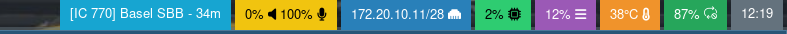

# Waybar/i3bar Traewelling status



This is a small bash script compatible with the waybar/i3bar to display your current train, destination and time remaining from your traewelling.de checkins.
It is a very hacky state and currently may have bugs and only follows public checkins, yet I wanted to share this to fellow work on train pro-users.

## How to use (waybar)

Edit the `traewelling.sh` script to your needs, don't forget to add your username

Add to your configuration:

```json
"custom/traewelling": {
    "format": "{}",
    "exec": "~/.path-to-script/traewelling.sh",
    "interval": 60,
}
```

Add to your style.css:

```css
#custom-traewelling {
   background-color: #eb4d4b;
   padding: 0 10px;
}
```

**Note:** make sure `curl` and `jq` are installed.